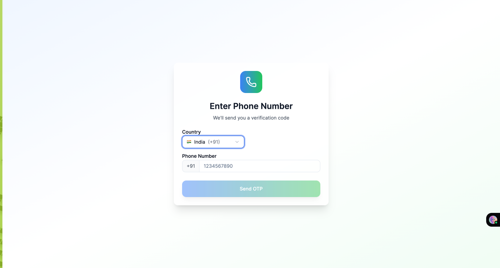
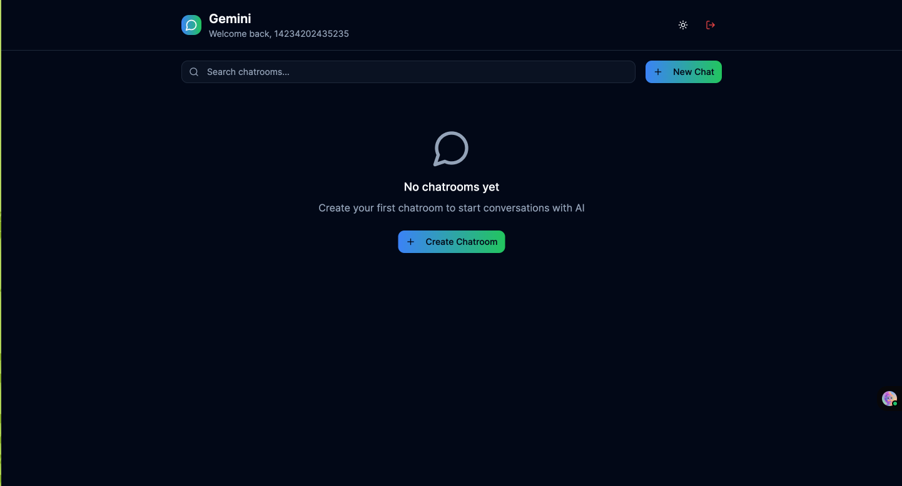
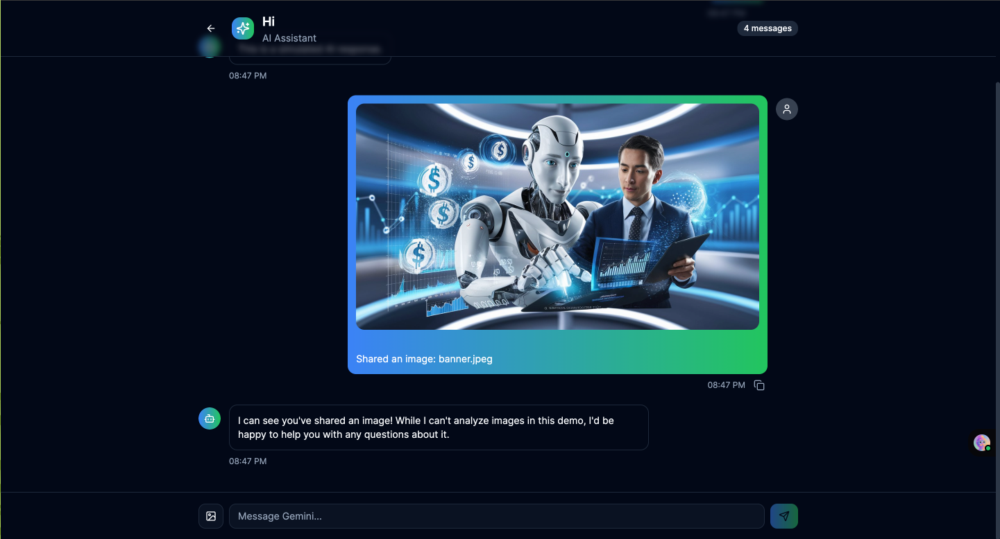
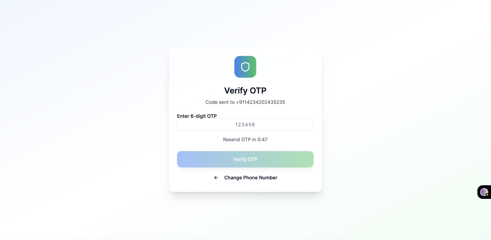

# Project Overview

This project is a modern React application bootstrapped with Vite and TypeScript. It features OTP-based authentication, a chat interface with simulated AI responses, image sharing, and a clean, responsive UI. The app demonstrates best practices in state management, component design, and user experience, using localStorage for persistence and custom hooks for modularity.

# Setup and Run Instructions

1. **Clone the repository:**
   ```sh
   git clone <repo-url>
   cd <project-folder>
   ```
2. **Install dependencies:**
   ```sh
   npm install
   ```
3. **Start the development server:**
   ```sh
   npm run dev
   ```
4. **Build for production:**
   ```sh
   npm run build
   ```
5. **Preview production build:**
   ```sh
   npm run preview
   ```

# Folder/Component Structure Explanation

- **src/components/**: Contains all React components, including:
  - **ui/**: Reusable UI elements (Button, Input, Card, etc.)
  - **OTPAuth.tsx**: Handles phone number authentication and OTP verification, including country selection and validation.
  - **Dashboard.tsx**: Main dashboard for chatroom management (create, search, delete, select chatrooms).
  - **Chat.tsx**: Chat interface for sending/receiving messages and images, with simulated AI responses.
- **src/hooks/**: Custom React hooks:
  - **useOTPAuth**: Manages authentication state and user session.
  - **useToast**: Handles toast notifications.
  - **useDarkMode**: Manages dark/light theme toggling.
- **src/types/**: TypeScript type definitions for entities like `Message`, `Chatroom`, `Country`, etc.
- **src/assets/**: Static assets such as images and icons (including screenshots for documentation).
- **src/App.tsx**: Main application entry point, handles authentication flow and routing.

# Feature Implementation Details

## Throttling
Throttling is implemented in the OTP authentication flow. When a user requests an OTP, a timer (`timeLeft`) is started, and the resend button is disabled until the timer expires. This prevents users from spamming OTP requests and ensures a minimum interval between requests.

## Infinite Scroll
Currently, infinite scroll is not implemented in the chat or chatroom lists. All messages and chatrooms are loaded at once from localStorage. For large datasets, infinite scroll could be added by loading more items as the user scrolls, but this is not present in the current codebase.

## Pagination
Pagination is **not** implemented. All chatrooms and messages are loaded and rendered in full. For scalability, pagination could be added in the future.

## Form Validation
Form validation is present in several places:
- **OTPAuth.tsx**: Validates phone number format, ensures a country is selected, and checks OTP length before allowing submission. Error messages are shown for invalid input, and action buttons are disabled until the input is valid.
- **Chat.tsx**: Disables the send button if the input is empty or if the AI is typing. Image uploads are validated for file presence.
Validation logic is handled using React state and conditional rendering.

## Other Features
- **Chatroom Management**: Users can create, search, and delete chatrooms. Chatrooms and messages are persisted in localStorage per user.
- **Simulated AI Responses**: The chat interface simulates AI responses with a delay using `setTimeout`.
- **Image Sharing**: Users can upload and share images in chat. Images are previewed and stored as data URLs.
- **Dark/Light Mode**: Users can toggle between dark and light themes.
- **Responsive UI**: The layout adapts to different screen sizes for a good user experience on both desktop and mobile.

# App Screenshots

### 1. OTP Verification


### 2. No Chatrooms Yet


### 3. Chat with Image


### 4. Enter Phone Number
